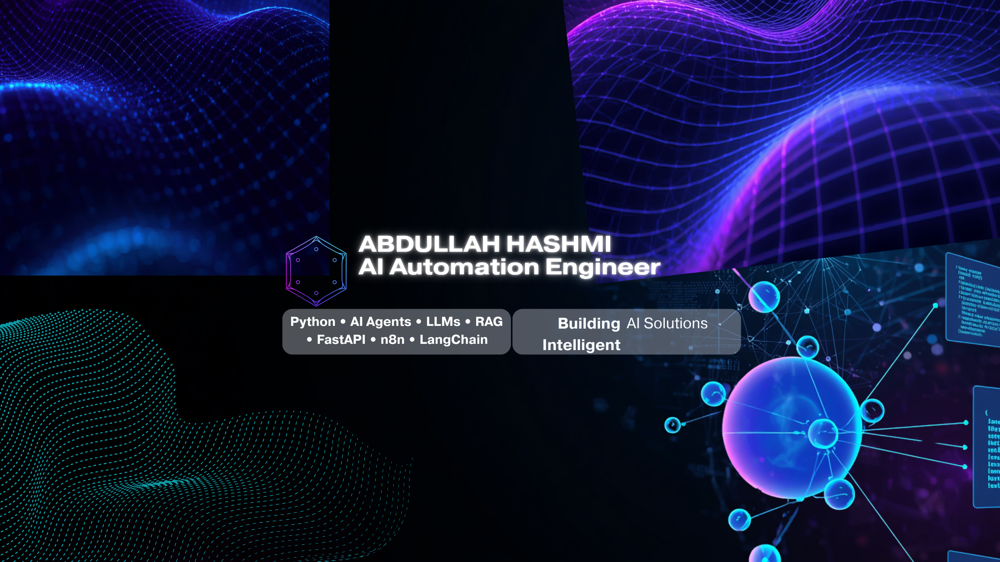

  

  
  
  
  

  📍 Based in Karachi, Pakistan &nbsp;|&nbsp; 🟢 Open to Work

<h1 align="center">Hi 👋, I'm Abdullah Hashmi</h1>

<h3 align="center">
AI Automation Engineer | Python Developer | AI Agents | LLMs | RAG
</h3>

Building AI-powered applications, intelligent agents, workflow automations, and backend systems using Python and modern LLM frameworks.

---

# 🚀 About Me

- 🤖 Building AI Agents and LLM Applications
- ⚡ Developing AI Workflow Automations using n8n & LangChain
- 📚 Building Retrieval-Augmented Generation (RAG) Systems
- 🔗 Integrating AI with APIs, Databases, and Business Applications
- 🐍 Python Backend Development using FastAPI & Flask
- 🌍 Based in Karachi, Pakistan
- 💼 Open to Junior AI Engineer & AI Automation Engineer Opportunities

---

# 🛠 Tech Stack

### Languages

- Python
- JavaScript
- SQL

### AI

- OpenAI
- Hugging Face
- Ollama
- LangChain
- LangGraph
- RAG
- Prompt Engineering

### Automation

- n8n
- Flowise
- REST APIs

### Backend

- FastAPI
- Flask
- PostgreSQL
- SQLite

### Deployment

- Git
- GitHub
- Railway
- Render

---

# 📌 Featured Projects

### 🔹 Multi-Agent Security System

AI-powered multi-agent security platform with modular architecture, authentication, role-based access, and scalable backend.

---

### 🔹 AI Data Analyst Agent

Enterprise AI assistant for analyzing business data and generating intelligent insights.

---

### 🔹 ResearchBot Pro

AI research assistant capable of document understanding and intelligent responses.

---

### 🔹 AI Workflow Automation

Business workflow automation using n8n, APIs, and AI Agents.

---

# 🌱 Currently Learning

- Advanced AI Agents
- Multi-Agent Systems
- Production AI Deployment
- Cloud AI Infrastructure
- Docker
- Kubernetes

---

# 📫 Contact

---

⭐ Thanks for visiting my profile.

Remove old banner code
